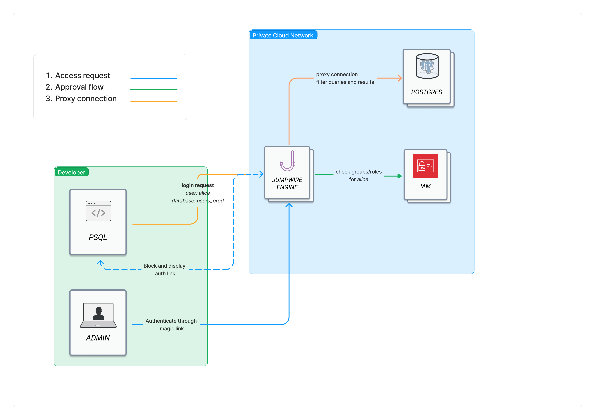

# jumpwire

[](https://jumpwire.io)


JumpWire is an engine that proxies database connections and applies security policies based on the data flowing through it. The fields within a database are assigned labels, either automatically or manually, making it easy to abstract the control of the data away from the raw structure of it.

Here are some examples of what JumpWire can do:

- Allow engineers to connect to production databases, but prevent them from seeing any private customer information
- Automatically encrypt PII as it enters your database and decrypt it only for a billing application
- Provide on-call engineers a way to quickly elevate database access when responding to an incident
- Keep an audit trail of access to sensitive data

## Features

Currently JumpWire supports proxying database clients to both PostgreSQL and MySQL.

Additional information is available in [our documentation](https://docs.jumpwire.io/).

### Privileged access management

Group access policies provide a way to control queries and ensure they will only return data that has been approved for a group member to access. Any query that attempts to access data types that are restricted will be rejected. In addition to controlling access to data types, specific query operations - `SELECT`, `UPDATE`, etc - can also be allowed or restricted.

**Enterprise only**: In addition to controlling group access, JumpWire Enterprise allows additional access to be granted in a just-in-time manner based on what data the user is actively querying for.

### Automatic schema discovery and labeling

JumpWire automatically detects and labels sensitive data in your existing schemas. Extra tools are provided to modify or add labels as needed.

### Field-level encryption

All fields for a configured label are automatically encrypted, either as they pass through the JumpWire proxy engine or directly in the database. Specific applications can be configured to decrypt the data through JumpWire automatically, without making any code changes or having to perform extra queries.

## How it works

The JumpWire engine is designed to be deployed in front of your existing database. Client configurations are updated to point to JumpWire instead of directly to the engine, and JumpWire proxies those connections through.

JumpWire works directly with the database protocol. All standard clients work with the engine without any code changes needed.

When a client attempts to connect through the proxy without credentials, a magic login link is generated. Using the [jwctl CLI](https://github.com/extragoodlabs/jwctl) or an integration available with JumpWire Enterprise, the login attempt can be linked to an SSO user and associated permissions.



## Installation

JumpWire is packages as Docker image and doesn't have any hard dependencies (beside the database being proxied, of course). The image is hosted on [GitHub Packages](https://github.com/extragoodlabs/jumpwire/pkgs/container/jumpwire)

jumpwire.yaml

Create a configuration file called `jumpwire.yaml`. The following example configures JumpWire to proxy through to a PostgreSQL server running on the local host with a database named `test_db` and a table named `users`:

```yaml
manifest:
- id: 0779b97a-c04a-48f9-9483-22e8b0487de4
  name: my local db
  root_type: postgresql
  credentials:
    username: postgres
    password: postgres
  configuration:
    type: postgresql
    database: test_db
    hostname: host.docker.internal
    ssl: false
    port: 5432

proxy_schema:
  - id: f764dd5b-fb38-401a-b414-edfa8230fd11
    name: users
    # must match the ID set for PostgreSQL
    manifest_id: 0779b97a-c04a-48f9-9483-22e8b0487de4
    fields:
      name: pii
      address: pii
      favorite_cheese: secret

groups:
  # Engineers will be able to do anything to data labeled
  # `secret` but all operations involving other labels
  # will be blocked
  Engineers:
    permissions:
    - select:secret
    - update:secret
    - insert:secret
    - delete:secret
```

Start the JumpWire engine:

``` shell
export ENCRYPTION_KEY=$(openssl rand -base64 32)
docker run -d --name jumpwire \
  -p 4004:4004 -p 4004:4004 -p 3307:3307 -p 6432:6432 \
  -v $(pwd)/jumpwire.yaml:/etc/jumpwire/jumpwire.yaml
  -e JUMPWIRE_CONFIG_PATH=/etc/jumpwire \
  -e JUMPWIRE_ENCRYPTION_KEY="${ENCRYPTION_KEY}" \
  ghcr.io/extragoodlabs/jumpwire:latest
```

With the container running, the JumpWire engine can connect to databases that are also running on the same host as the container, or accessible from the same host. This setup is ideally suited for testing JumpWire in a local development environment, or for small-scale apps that have a full tech stack on a single host.

### Kubernetes

A Helm chart is available for deploying JumpWire into Kubernetes. Documentation is available at [https://docs.jumpwire.io/self-hosting-with-helm](https://docs.jumpwire.io/self-hosting-with-helm).

### Ports

The following ports are used by default:

- `4004` - HTTP server for JSON API requests
- `4443` - HTTPS server for JSON API requests
- `9568` - HTTP server exposing metrics in Prometheus format
- `6432` - client connections for PostgreSQL
- `3307` - client connections for MySQL

These can be configured as noted below.

## Configuration

### Configuration files

Setting up connections to proxied databases and the policies governing those is done with YAML files. The configuration can be broken into multiple files; every YAML file within the configured directory will be loaded and merged together. The env var `JUMPWIRE_CONFIG_PATH` is used to set the directory containing config files.

The available configuration options are detailed in [our documentation](https://docs.jumpwire.io/local-file-configuration).

### Environmental variables

| Name | Default | Description |
| --- | --- | --- |
| JUMPWIRE_ENCRYPTION_KEY | - | Secret used for performing field level AES encryption |
| JUMPWIRE_ROOT_TOKEN | - | Root token for the HTTP API. If not provided, a token will be automatically generated.
| JUMPWIRE_TOKEN_KEY | value of JUMPWIRE_ROOT_TOKEN | Secret key used for signing and verifying tokenized data. |
| LOG_LEVEL | info | Verbosity for logging. |
| RELEASE_COOKIE | - | Shared secret used for distributed connectivity. Must be identical on all nodes in the cluster. |
| JUMPWIRE_TOKEN | - | Token used to authenticate with the web interface. |
| JUMPWIRE_FRONTEND | - | WebSocket URL to connect to when using a web controller |
| JUMPWIRE_DOMAIN| localhost | Domain of the JumpWire engine |
| JUMPWIRE_HTTP_PORT | 4004 | Port to listen for HTTP request. |
| JUMPWIRE_HTTPS_PORT | 4443 | Port to listen for HTTPS request. |
| JUMPWIRE_PROMETHEUS_PORT | 9568 | Port to serve Prometheus stats on, under the `/metrics` endpoint. |
| JUMPWIRE_POSTGRES_PROXY_PORT | 6432 | Port to listen for incoming postgres clients |
| JUMPWIRE_MYSQL_PROXY_PORT | 3307 | Port to listen for incoming mysql clients. |
| JUMPWIRE_TLS_CERT | - | Public cert to use for HTTPS |
| JUMPWIRE_TLS_KEY | - | Private key to use for HTTPS |
| JUMPWIRE_TLS_CA | [CAStore](https://github.com/elixir-mint/castore) | CA cert bundle to use for HTTPS |
| JUMPWIRE_CONFIG_PATH | priv/config | Directory to load YAML config files from. |
| VAULT_ADDR | http://localhost:8200 | URL of a HashiCorp Vault server to use for key management. |
| VAULT_KV_VERSION | 2 | Whether to use version `1` or `2` of the Vault KV API. |
| VAULT_KV_PATH | secret/jumpwire | Path in Vault to a KV store. The provided token/role should have write access to this. |
| VAULT_DB_PATH | database | Mount point of database secrets in Vault. JumpWire will lookup databases and roles under this path for possible proxy credentials. |
| VAULT_APPROLE_ID | - | ID of an approle to authenticate with Vault. Either a token or an approle must be provided to enable Vault. |
| VAULT_APPROLE_SECRET | - | Secret of an approle to authenticate with Vault. Either a token or an approle must be provided to enable Vault. |
| VAULT_TOKEN | - | Token to use to authenticate with Vault. Either a token or an approle must be provided to enable Vault. |
| VAULT_NAMESPACE | - | Namespace to use with Vault Enterprise. |
| JUMPWIRE_AWS_KMS_ENABLE | - | When set to `true` AWS KMS will be used for generating encryption keys. |
| JUMPWIRE_AWS_KMS_KEY_NAME | jumpwire | A prefix to use for aliases when creating AWS KMS keys.|
| HONEYBADGER_API_KEY | - | API key to enable error reporting to HoneyBadger. |
| SENTRY_DSN | - | DSN to enable error reporting to Sentry. |
| JUMPWIRE_ENV | prod | Environment to use in events for 3rd party error reporting. |
| JUMPWIRE_PARSE_REQUESTS | true | When true, requests being proxied through JumpWire will be inspected and access policies will be applied. |
| JUMPWIRE_PARSE_RESPONSES | true | When true, responses from requests proxied through JumpWire will be inspected and access policies will be applied. |
| ACME_GENERATE_CERT | true |
| ACME_CERT_DIRECTORY | priv/pki | Disk location to store ACME generated certificates. |
| ACME_EMAIL | - | Email to use in CSRs. |
| JUMPWIRE_SSO_METADATA_PATH | - | Path to an XML file containing metadata for the SSO IdP. |
| JUMPWIRE_SSO_IDP | - | Identifier for the SSO IdP. This will be used in API paths. |
| JUMPWIRE_SSO_SPID | jumpwire | When registering JumpWire as an SSO service provider, this ID will be used. |
| JUMPWIRE_SSO_SIGNED_ENVELOPES | true | Whether to expect the SSO IdP to sign its SAML envelopes. |
| JUMPWIRE_SSO_GENERATED_CERTNAME | localhost | Name of ACME generated TLS certificate to use with SSO requests. Not used if a TLS cert and key are explicitly configured. |
| JUMPWIRE_SSO_GROUPS_ATTRIBUTE | Group | Attribute on SAML assertions listing the groups a user is a member of. |

### Encryption keys

By default, JumpWire will use an AES key stored in a local file for any encryption operations. For production usage, we **strongly** recommend configuring a key management service instead. JumpWire will use a master key from this service and derive subkeys from it, greatly improving both security and durability of the encryption keyring.

HashiCorp Vault and AWS KMS are supported as encryption key stores. More information on configuring these is available in [our documentation](https://docs.jumpwire.io/encryption-key-stores).

## CLI

The JumpWire engine can be interacted with using the [jwctl](https://github.com/extragoodlabs/jwctl) CLI tool. jwctl connects to the API of a running JumpWire cluster to perform administrative tasks and authenticate proxied database connections using SSO credentials.

## Telemetry

Operational metrics are collected by the JumpWire engine can exported to Prometheus, StatsD, or CloudWatch. A full list of metrics is available in [our documentation](https://docs.jumpwire.io/observability).

## Support and bug reports

**Please disclose security vulnerabilities privately at security@jumpwire.io.**

If you run into an error or unexpected behavior, please [file an issue](https://github.com/extragoodlabs/jumpwire/issues).

All other questions and support requests should be asked in [GitHub discussions](https://github.com/extragoodlabs/jumpwire/discussions).


## Contributing

Read [CONTRIBUTING.md](CONTRIBUTING.md) to learn about project code style and practices, as well as how to runn JumpWire from source.

## License

This repo is licensed under [Apache 2.0](LICENSE).

An enterprise version of JumpWire is also available with additional features and a web interface for controlling the engine.

To learn more, visit our [pricing page](https://jumpwire.io/pricing).
