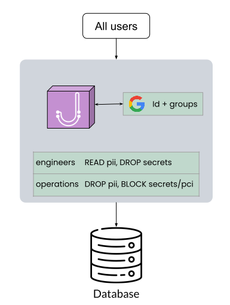
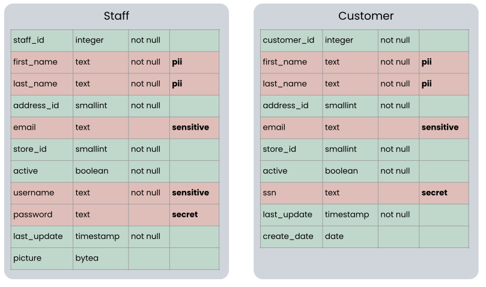

## Group access policies with JumpWire

Databases running in production often store all sorts of data. Much of this data is innocuous - such as internal UUIDs, application state, activity logs; but a subset of data is highly confidential - customer personal information, passwords and generated content. Databases aren't designed to distinguish between different data types that correspond to "sensitivity", or how a company might classify some of the data they collect as "internal" and other data "confidential".

Instead databases organize data through relationships, and are optimized to make retrieval across dimensions of relationships very efficient. (A full overview of [Boyce-Codd Normal Form](https://en.wikipedia.org/wiki/Boyce%E2%80%93Codd_normal_form) is out of scope for this guide.) This encourages developers to store data of varying sensitivity into the same tables.

Additionally, database permission models focus on restricting which tables an individual can read or modify. This presents a security challenge for administrators, as they are trying to control who can access confidential data. And because that data is commingled in tables with other data, native database permission models don't help.

### Using JumpWire to label data and manage access

JumpWire is designed with two key features to solve this problem.
1. Label individual columns to designate if they contain confidential data
1. Define rules for groups that permit or restrict group members from reading or modifying a particular label

This allows administrators to granularly control access to data, regardless of how it is stored in the underlying database. They can enforce the policies from an information security program like SOC2 that specify which roles in an organization can or can't access confidential data.

In this guide we'll configure JumpWire to allow some groups to be able to query customer secrets while blocking queries for other groups. It will also restrict anyone from updating or deleting read-only data.

#### Group membership via Single Sign-On

As a prerequisite, we [set up Single Sign-On](./sso-guide.md) to connect JumpWire to an Identity Provider. Users will authenticate with their IdP, and the response for a successful authentication will contain a list of groups that the user is a member of. This lets us define permissions at a group level, which aligns with a Role Based Access Control (RBAC) model.

<div style="margin: auto; width: 50%;">
  
</div>

#### Labeling fields via configuration

Let's define the configuration terminology for JumpWire that we will use in this example.

| YAML block | Description |
| --- | --- |
| manifest | Defines a data source, which in this example is a PostgreSQL database |
| proxy_schema | A list of `field: label` pairs that correspond to a table in the database |
| groups | A map of a `group name` to a list of `permissions` which define what operations that group can perform on labels |


(Before snickering, recall that naming is the hardest thing about writing software)

Here's the complete configuration we are using:
```yaml
manifests:
  # `id` should be a UUIDv4
  - id: 0779b97a-c04a-48f9-9483-22e8b0487de4
    # `name` is a user friendly identifier for this database.
    # it will appear as a selection option when running `jwctl auth login`
    name: my local db
    # `root_type` corresponds to the database distribution
    root_type: postgresql
    # `credentials` are log in details that JumpWire uses to connect to the underlying database.
    # typically these are injected from a secret store
    credentials:
      username: postgres
      password: postgres
    # `configuration` contains additional connection details
    configuration:
      type: postgresql
      database: test_db
      hostname: host.docker.internal
      # set to `true` to enforce ssl
      ssl: false
      port: 5432
      # defaults to `public`
      schema: public

proxy_schemas:
  # `id` should be a UUIDv4
  - id: f764dd5b-fb38-401a-b414-edfa8230fd11
    # `name` should match the table name in the database 
    name: staff
    # `manifest_id` must match the ID of the manifest defined above
    manifest_id: 0779b97a-c04a-48f9-9483-22e8b0487de4
    # `fields` is a map of column name: label
    # not all columns in a table need labeling, only those requiring special permissions
    fields:
      first_name: pii
      last_name: pii
      username: sensitive
      email: sensitive
      password: secret
  # there can be multiple proxy_schemas per database, each corresponding to a different table
  - id: af68078d-87a8-4775-9c30-9a2ba125a368
    name: customer
    # using the same `manifest_id`
    manifest_id: 0779b97a-c04a-48f9-9483-22e8b0487de4
    fields:
      first_name: pii
      last_name: pii
      email: sensitive
      ssn: secret

groups:
  # map group name: permissions
  # `Engineers` is the name of a group present in the SSO identity provider
  Engineers:
    # `permissions` is a list of operations that members of the Engineers group can perform
    permissions:
      - select:pii
      - select:sensitive
      - select:secret
      - update:pii
      - update:sensitive
  Customer Ops:
    permissions:
      - select:pii
      - select:sensitive
```

The configuration above is for a PostgreSQL database, and defines permissions for two tables - `staff` and `customers`. A few columns in each table are given labels, so that we can restrict how the data in those columns can be manipulated by people with query access.

Here's a visual view of the schema we are working with, along with the labels we've assigned:



#### Permission breakdown

We've defined the permission structure to allow for the following scenarios:

**Members of "Engineers" group can query all labels, and update `pii` and `sensitive` columns**

In effect, this allows engineers to read data from all of the sensitive columns in the database. They can even update the name, email and username columns. However they cannot insert or delete any of these columns, and because the name columns have "not null" constraints, this means that engineers cannot insert new rows or delete existing rows in either table.

Here's what that looks like in a psql shell:

```shell
$ psql "postgres://test-db.hook.jumpwire.cloud"
NOTICE:  Protected by JumpWire
Authenticate by visiting:
    https://stage.jumpwire.io/authenticate/SFMyNTY....
psql (15.3 (Ubuntu 15.3-1.pgdg22.04+1), server 15.4)
SSL connection (protocol: TLSv1.3, cipher: TLS_AES_256_GCM_SHA384, compression: off)
Type "help" for help.

ryan=> select * from staff limit 5;
 staff_id | first_name | last_name | address_id |           email           | store_id | active | username | password |        last_update         | picture

----------+------------+-----------+------------+---------------------------+----------+--------+----------+----------+----------------------------+---------
        3 | Eric       | Moreno    |        242 | hmay@smith-logan.info     |        2 | t      | Eric     |          | 2023-10-11 03:03:57.577038 |
        4 | John       | Lawrence  |        396 | nicolemoran@herrera.com   |        1 | t      | John     |          | 2023-10-11 03:03:57.577038 |
        5 | Jennifer   | Wilson    |        159 | laurenmitchell@french.com |        1 | t      | Jennifer |          | 2023-10-11 03:03:57.577038 |
        6 | Phillip    | Cross     |        326 | qpowell@anderson.com      |        2 | t      | Phillip  |          | 2023-10-11 03:03:57.577038 |
        7 | Rebecca    | Fletcher  |        441 | uramirez@rodriguez.com    |        2 | t      | Rebecca  |          | 2023-10-11 03:03:57.577038 |
(5 rows)

ryan=> update staff set first_name = 'Erlic', username = 'Erlic' where staff_id = 3;
UPDATE 1

ryan=> insert into staff values (99, 'Jack', 'Jackson', 1, 'jack@notanemail.org', 1, 'jackjack', 'notapassword');
ERROR:  blocked by JumpWire policy. A request for additional access was generated and can be viewed at:
    https://stage.jumpwire.io/authorize/bd8dd27d...

ryan=> select * from customer where email = 'perezthomas@hunter.com';
 customer_id | store_id | first_name | last_name |         email          | ssn | address_id | activebool | create_date |     last_update     | active
-------------+----------+------------+-----------+------------------------+-----+------------+------------+-------------+---------------------+--------
          10 |      211 | Sara       | Lewis     | perezthomas@hunter.com |     |        353 | t          | 2015-11-05  | 2023-03-19 15:14:36 |      1
(1 row)
```

The engineer was able to query from Staff and even update columns containing PII, however they were not allowed to insert a new record. Same for Customer.

**Members of "Customer Ops" group can only query `pii`, but not read/insert/update/delete any other columns**

In effect, this allows customer support to query only specific fields from Customer and Staff. They cannot insert, modify or delete any records, which means they have read-only access to those tables. Let's see how this works with the queries run above.

```shell
ryan=> select * from staff limit 5;
ERROR:  blocked by JumpWire policy. A request for additional access was generated and can be viewed at:
    https://stage.jumpwire.io/authorize/61f4e989...

ryan=> select staff_id, first_name, last_name, username from staff limit 10;
 staff_id | first_name  | last_name |  username
----------+-------------+-----------+-------------
        4 | John        | Lawrence  | John
        5 | Jennifer    | Wilson    | Jennifer
        6 | Phillip     | Cross     | Phillip
        7 | Rebecca     | Fletcher  | Rebecca
        8 | Sonia       | Ross      | Sonia
        9 | Jeremiah    | Roberts   | Jeremiah
       10 | Kara        | Weber     | Kara
       11 | Eddie       | Wagner    | Eddie
       12 | John        | Johnson   | John
       13 | Christopher | Taylor    | Christopher
(10 rows)

ryan=> update staff set first_name = 'Erlic', username = 'Erlic' where staff_id = 3;
ERROR:  blocked by JumpWire policy. A request for additional access was generated and can be viewed at:
    https://stage.jumpwire.io/authorize/61f4e989...
```

Note that the `select * from staff limit 5;` query failed because it would have returned the column `password` that is labeled `secret`.

Additionally, because neither group have permission to `delete` labels, they aren't able to delete any rows from either table. This is a great safeguard against developers inadvertently running destructive queries in production (which in my experience happens at every company).