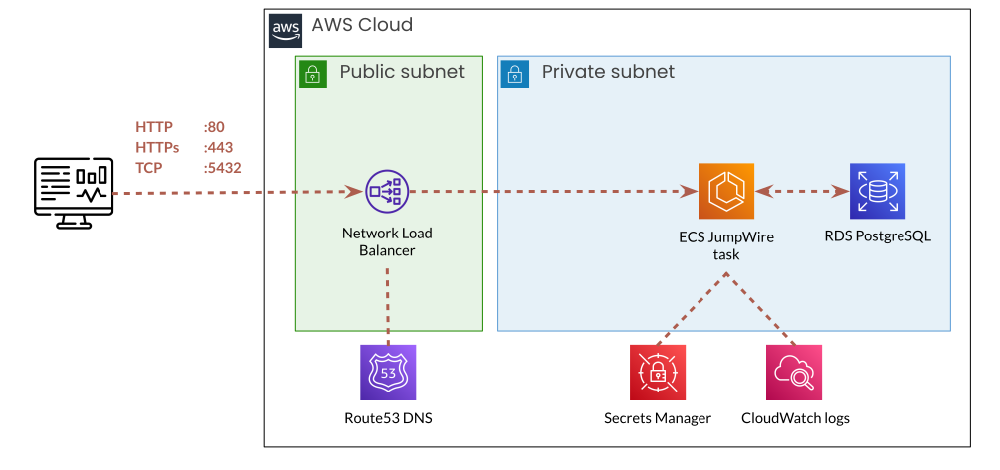
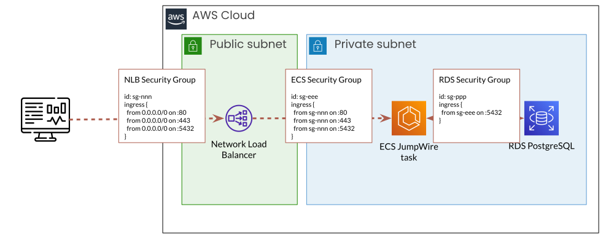
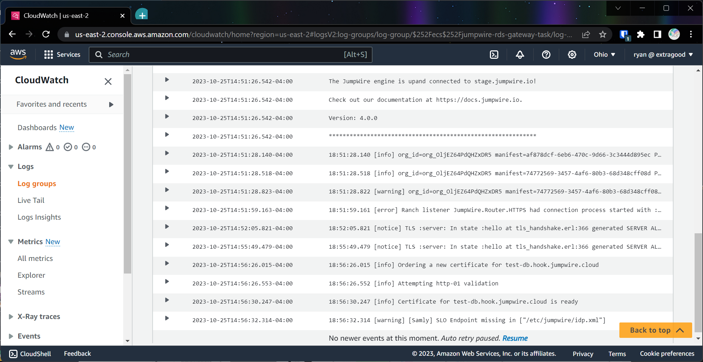
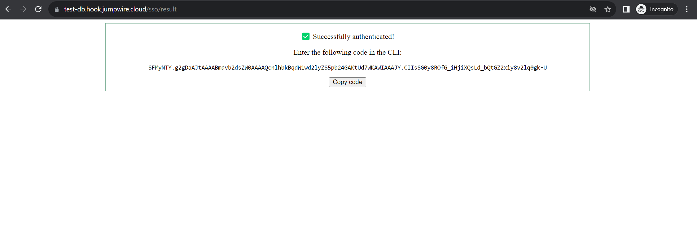

## AWS RDS Gateway Guided setup

In live environments, it's best practice to launch backend databases in private networks that aren't reachable from the Internet. This security practice is called "network segmentation", and it bolsters security by making it harder for attackers to break into systems that store confidential data. For RDS servers on AWS, they would be running in a private subnet of a VPC, and not be assigned a public IP address.

So what happens when you need to let some people access production databases, to run analytics or troubleshoot problems? One option is to give each person an AWS IAM username/login, train them on using the AWS cli, and set up your own bastion host. This is pretty tedious to do for large teams.

Alternatively, you can use a JumpWire gateway, and let people connect to the database using Single Sign-On, like any other SaaS app!

In this guide, we'll lay out all the steps needed to run JumpWire as an ECS task. The ECS task will run in a private subnet along with the RDS instance. To connect to the gateway we set up an API Gateway to login via SSO over HTTPS, and a network load balancer to proxy PostgreSQL connections.

Finally, we can follow the same steps from the [SSO guide](./sso-guide.md) to configure a Google SAML app for login.

### Architecture overview

We will be setting up the simple architecture diagrammed below, using Terraform. The full code sample can by found at [JumpWire infrastructure tools](https://github.com/extragoodlabs/infrastructure-tools/tree/main/terraform/aws/ecs/example/rds-gateway).

It launches the JumpWire gateway as an ECS task running on Fargate, a full serverless setup. The ECS task also runs in a private subnet of the VPC along with the database. A Network Load Balancer listens for connections from the Internet, and forwards them to our gateway task. A DNS hostname is associated with the Load Balancer using Route53.

This guide assumes there is an existing VPC created with public and private subnets. It will create an RDS instance in the private subnet along with the JumpWire gateway, but you can use an existing database if you are launching into a live environment.



### Prerequisites

In addition to having a VPC already created, this guide uses `docker` to build an image locally with all the configuration the gateway needs to communicate with the SSO provider and RDS database. We'll also use `jwctl` to log in via SSO and `psql` to connect to our RDS database.

- [terraform](https://developer.hashicorp.com/terraform/tutorials/aws-get-started/install-cli) - for IaC
- [Docker](https://docs.docker.com/engine/install/) - for bundling configuration into Docker image
- [jwctl](https://github.com/extragoodlabs/jwctl) - for interacting with the JumpWire API
- [mkcert](https://github.com/FiloSottile/mkcert) - (optional) for generating self-signed certificates

### Terraform variables

Our terraform template requires the following variables as input. For a full list of variables, reference the file `variables.tf`.

|Variable|Description|
|---|---|
|jumpwire_root_token|Used for interacting with the gateway API. Best to read this from `$HOME/.config/jwctl/.token`|
|jumpwire_encryption_key|Used for field encryption. If not using field encryption, can use random value `openssl rand -base64 32`|
|vpc_id|ID of the VPC to launch new services. This guide won't create the VPC, so it needs an ID for an existing one|
|vpc_private_subnet_ids|List of private subnet IDs that are in the VPC referenced above|
|vpc_public_subnet_ids|List of public subnet IDs that are in the VPC referenced above|
|route53_zone_name|Name of Route53 zone to create a DNS record for the NLB. It will be `test-db.[zone_name]`|


If this is your first time using `jwctl`, you can create a new random root token to passed as a variable to terraform.
```shell
mkdir -p ~/.config/jwctl
cat /dev/urandom | base64 | head -c 64 > $HOME/.config/jwctl/.token
```

### Security Groups

The guide creates security groups to restrict traffic between the Internet and our NLB, and between the NLB, our gateway and the database. This ensures only the NLB is exposing open ports to the Internet, and the rest of our infrastructure stays private and unreachable except through the NLB.



It may be necessary to add additional ingress rules to the RDS security group to allow other applications the ability to connect directly to the database. However this is not strictly necessary, as you can connect everything through JumpWire!

### RDS instance

This guide creates a new RDS instance, but in most cases we already have an RDS instance running. Simply replace the `resource` blocks with a `data` block referencing the existing RDS instance.

```terraform
#
# Create an RDS instance.
# If you already have a database running, you can replace this with a data block.
# All we need is the username/password/hostname to configure the gateway container.
#

data "aws_db_instance" "test_db" {
  db_instance_identifier = "test_db"
}
```

The database credentials that JumpWire will use to connect to RDS are referenced in a locals block. The guide creates a new random password for the RDS instance, but you can replace them with existing credentials.

```terraform
locals {
  root_dir       = path.module
  aws_account_id = data.aws_caller_identity.current.account_id
  # Create username and random password when creating a new RDS instance
  rds_username   = "jumpwire"
  rds_password   = random_password.db_password.result
  # If using an existing RDS instance, load username/password from data source
  # rds_username     = data.aws_db_instance.test_db.master_username
  # rds_username     = data.aws_db_instance.test_db.master_user_secret

  token_secret = {
    JUMPWIRE_ROOT_TOKEN     = "${var.jumpwire_root_token}"
    JUMPWIRE_ENCRYPTION_KEY = "${var.jumpwire_encryption_key}"
  }
}
```

### Docker image

The template builds a Docker image to wrap a configuration into the running container. It references the database connection details from resources and passes them as build arguments to Docker.

```terraform
resource "aws_ecr_repository" "task_repository" {
  name         = "jumpwire-rds-gateway-repository"
  force_delete = true
}

resource "null_resource" "task_ecr_image_builder" {
  depends_on = [
    aws_db_instance.test_db
  ]

  triggers = {
    docker_file       = filesha256("${local.root_dir}/Dockerfile")
    dockerignore_file = filesha256("${local.root_dir}/.dockerignore")
    config_file       = filesha256("${local.root_dir}/jumpwire.yaml")
  }

  provisioner "local-exec" {
    working_dir = local.root_dir
    interpreter = ["/bin/bash", "-c"]
    command     = <<-EOT
      aws ecr get-login-password --region ${var.region} --profile ${var.aws_profile} | docker login --username AWS --password-stdin ${local.aws_account_id}.dkr.ecr.${var.region}.amazonaws.com
      docker image build -t ${aws_ecr_repository.task_repository.repository_url}:latest --build-arg db_name=${aws_db_instance.test_db.db_name} --build-arg db_username=${local.rds_username} --build-arg db_password=${local.rds_password} --build-arg db_hostname=${aws_db_instance.test_db.address} .
      docker push ${aws_ecr_repository.task_repository.repository_url}:latest
    EOT
  }
}
```

The Dockerfile copies a templated configuration file `jumpwire.yaml` into the container, and replaces placeholder values with the build args:
```dockerfile
# bump version 0.3
FROM ghcr.io/extragoodlabs/jumpwire:latest

ARG db_name
ARG db_username
ARG db_password
ARG db_hostname

# Create app directory
WORKDIR /etc/jumpwire

# Create config with RDS connection string
COPY jumpwire.yaml ./

RUN sed -i "s|DB_NAME|$db_name|" ./jumpwire.yaml
RUN sed -i "s|DB_USERNAME|$db_username|" ./jumpwire.yaml
RUN sed -i "s|DB_PASSWORD|$db_password|" ./jumpwire.yaml
RUN sed -i "s|DB_HOSTNAME|$db_hostname|" ./jumpwire.yaml

ENV JUMPWIRE_CONFIG_PATH=/etc/jumpwire
```

The `jumpwire.yaml` configuration file has placeholder values inline the yaml:
```yaml
manifests:
  - id: 710276d9-c790-45bd-8f6a-3c7016d57315
    name: DB_NAME
    root_type: postgresql
    credentials:
      username: DB_USERNAME
      password: DB_PASSWORD
    configuration:
      type: postgresql
      database: DB_NAME
      hostname: DB_HOSTNAME
      ssl: true
      port: 5432

client_auth:
  - id: 77d2e5c3-3786-4aeb-86d8-03c82a066134
  name: psql
    manifest_id: 710276d9-c790-45bd-8f6a-3c7016d57315
```

Finally this image is uploaded to an ECR repository, from which we can pull the image to run as an ECS task.

### Load balancer

The Network Load Balancer is listening on HTTP and PG ports and forwarding that traffic to the ECS gateway service. It lets us keep our gateway in a private subnet of the VPC, not exposed to the Internet through network isolation. It also runs health checks on each port to ensure that our gateway service is reachable.

For each port that needs forwarding (80, 443, 5432) we create a listener and target group.

```terraform
resource "aws_lb" "jumpwire_nlb" {
  name               = "jumpwire-rds-gateway-nlb"
  internal           = false
  load_balancer_type = "network"
  subnets            = var.vpc_public_subnet_ids
  security_groups    = [aws_security_group.network_load_balancer.id]
}

resource "aws_lb_target_group" "jumpwire_http_nlb" {
  name                   = "jumpwire-rds-gateway-http-tar"
  target_type            = "ip"
  # NOTE use the container port that references this group as its LB
  port                   = 4004
  protocol               = "TCP"
  vpc_id                 = var.vpc_id
  connection_termination = true
  deregistration_delay   = 30

  health_check {
    protocol          = "TCP"
    healthy_threshold = 2
    interval          = 5
    timeout           = 2
  }
}

resource "aws_lb_listener" "jumpwire_http_nlb" {
  load_balancer_arn = aws_lb.jumpwire_nlb.arn
  protocol          = "TCP"
  port              = 80

  default_action {
    type             = "forward"
    target_group_arn = aws_lb_target_group.jumpwire_http_nlb.arn
  }
}

# Repeat resources "aws_lb_target_group" and "aws_lb_listener" for ports 443 and 5432
```

### DNS

For HTTPs, we need to generate certificates for our gateway. To issue valid certificates we need a hostname, and we use Route53 to assign a DNS record to our NLB. It references the NLB's dns name:
```terraform
data "aws_route53_zone" "jumpwire_zone" {
  name = var.route53_zone_name
}

resource "aws_route53_record" "jumpwire_hostname" {
  zone_id = data.aws_route53_zone.jumpwire_zone.zone_id
  name    = "test-db"
  type    = "A"

  alias {
    name                   = aws_lb.jumpwire_nlb.dns_name
    zone_id                = aws_lb.jumpwire_nlb.zone_id
    evaluate_target_health = true
  }
}
```

#### Automatic certificate generation

The JumpWire gateway will automatically generate certificates for both TLS and signing the SAML requests using [Let's Encrypt](https://letsencrypt.org/).

Our template sets the container environment variable `JUMPWIRE_DOMAIN` to the value of the Route53 DNS record hostname. Simply add a valid email as the value of the environment variable `ACME_EMAIL`, and the gateway will do the rest on startup!

>Note that because we are running the gateway behind an ELB, we also set `ACME_GENERATE_CERT_DELAY` to account for the health checks.


||
|:--:| 
| *Logs showing successful certificate order* |


### SSO 

For a detailed overview of configuring the gateway to use SSO, see our [SSO configuration walkthrough](./sso-guide.md).

We follow the same SSO setup, only using our hostname in the ACS URL `https://test-db.hook.jumpwire.cloud/sso/sp/consume/google`. The `GoogleIDPMetadata.xml` file gets bundled into our docker container, and we set environment variables to configure SSO.

```Dockerfile
# bump version 0.84
FROM ghcr.io/extragoodlabs/jumpwire:latest

# ARGs...

# Create app directory
WORKDIR /etc/jumpwire

# Create config with RDS connection string
COPY jumpwire.yaml ./
COPY GoogleIDPMetadata.xml ./idp.xml

# RUN seds...

# ENVs...
ENV JUMPWIRE_SSO_METADATA_PATH=/etc/jumpwire/idp.xml
ENV JUMPWIRE_SSO_IDP=google
ENV JUMPWIRE_SSO_SIGNED_ENVELOPES=false
```

### Task Definition

Now that our container is correctly configured, built and uploaded to an AWS repository, we can reference it in the task definition. The full task definition is below.

A few notes:
- We set environment variables here that reference other AWS resources, as well as the secrets holding sensitive arguments
- In an [August 2023 update](https://aws.amazon.com/blogs/containers/announcing-additional-linux-controls-for-amazon-ecs-tasks-on-aws-fargate/), Fargate supports additional Linux system controls. We set system-level TCP keepalive configurations to avoid the NLB closing sockets after timeout.
- Host ports are matching the container ports. We'll use those container ports when we connect the NLB to the ECS service below.
- This task definition is using a container with loaded certificate files. If we want the gateway to generate certificates, set `ACME_GENERATE_CERT` to `true`, and provide a valid `ACME_EMAIL`.

```terraform
resource "aws_ecs_task_definition" "jumpwire_task" {
  depends_on = [
    null_resource.task_ecr_image_builder,
    aws_lb.jumpwire_nlb
  ]

  family                   = "jumpwire-rds-gateway-task"
  requires_compatibilities = ["FARGATE"]
  network_mode             = "awsvpc"
  cpu                      = var.task_cpu
  memory                   = var.task_memory
  execution_role_arn       = aws_iam_role.ecs_task_execution_role.arn
  task_role_arn            = aws_iam_role.ecs_task_execution_role.arn
  container_definitions    = <<TASK_DEFINITION
[
  {
    "name": "jumpwire-gateway-container",
    "image": "${aws_ecr_repository.task_repository.repository_url}:latest",
    "cpu": ${var.task_cpu},
    "memory": ${var.task_memory},
    "essential": true,
    "systemControls": [
        {
            "namespace": "net.ipv4.tcp_keepalive_time",
            "value": "55"
        },
        {
            "namespace": "net.ipv4.tcp_keepalive_intvl",
            "value": "55"
        }
    ],
    "portMappings": [
      {
        "hostPort": 4004,
        "protocol": "tcp",
        "containerPort": 4004
      },
      {
        "hostPort": 4443,
        "protocol": "tcp",
        "containerPort": 4443
      },
      {
        "hostPort": 5432,
        "protocol": "tcp",
        "containerPort": 5432
      }
    ],
    "environment": [
      {
        "name": "JUMPWIRE_DOMAIN",
        "value": "${aws_route53_record.jumpwire_hostname.fqdn}"
      },
      {
        "name": "JUMPWIRE_SSO_BASE_URL",
        "value": "https://${aws_route53_record.jumpwire_hostname.fqdn}"
      },
      {
        "name": "ACME_EMAIL",
        "value": "you@yourdomain.co"
      },
      {
        "name": "ACME_GENERATE_CERT_DELAY",
        "value": "300"
      },
      {
        "name": "ACME_GENERATE_CERT",
        "value": "true"
      }
    ],
    "secrets": [
      {
        "valueFrom": "${aws_secretsmanager_secret.jumpwire_token.arn}:JUMPWIRE_ROOT_TOKEN::",
        "name": "JUMPWIRE_ROOT_TOKEN"
      },
      {
        "valueFrom": "${aws_secretsmanager_secret.jumpwire_token.arn}:JUMPWIRE_ENCRYPTION_KEY::",
        "name": "JUMPWIRE_ENCRYPTION_KEY"
      }
    ],
    "logConfiguration": {
      "logDriver": "awslogs",
      "secretOptions": null,
      "options": {
        "awslogs-group": "/ecs/jumpwire-rds-gateway-task",
        "awslogs-region": "${var.region}",
        "awslogs-stream-prefix": "ecs"
      }
    }
  }
]
TASK_DEFINITION

  runtime_platform {
    operating_system_family = "LINUX"
  }
}
```

### ECS Service

Finally we define the ECS service to run our gateway task. Here we connect our NLB to the ECS task by mapping the target groups to container ports, and use the security group that allows traffic from the NLB to container ports.

```terraform
resource "aws_ecs_service" "jumpwire" {
  depends_on = [
    null_resource.task_ecr_image_builder
  ]

  name          = "jumpwire-rds-gateway-service"
  cluster       = aws_ecs_cluster.jumpwire.id
  desired_count = 1

  # Track the latest ACTIVE revision
  task_definition                   = aws_ecs_task_definition.jumpwire_task.arn
  health_check_grace_period_seconds = 30
  enable_execute_command            = true
  force_new_deployment              = true

  network_configuration {
    subnets         = var.vpc_private_subnet_ids
    security_groups = [aws_security_group.ecs_service.id]
  }

  capacity_provider_strategy {
    base              = 1
    weight            = 100
    capacity_provider = "FARGATE"
  }

  load_balancer {
    target_group_arn = aws_lb_target_group.jumpwire_http_nlb.arn
    container_name   = "jumpwire-gateway-container"
    container_port   = 4004
  }

  load_balancer {
    target_group_arn = aws_lb_target_group.jumpwire_https_nlb.arn
    container_name   = "jumpwire-gateway-container"
    container_port   = 4443
  }

  load_balancer {
    target_group_arn = aws_lb_target_group.jumpwire_pg_nlb.arn
    container_name   = "jumpwire-gateway-container"
    container_port   = 5432
  }
}
```

### Profit

Now we can use the JumpWire gateway to connect to our RDS database! The RDS instance is in a private network, unreachable by external connections, and we made no modifications to the database setup to use JumpWire. Our gateway runs as a private ECS task, encrypts all traffic, and authentication is centrally managed by Google SSO. Now we can provision database access to employees just like any other SaaS app.

```shell
$ jwctl auth login google
[INFO] The login URL will open automatically in your browser. If it does not, you can enter it directly:

https://test-db.hook.jumpwire.cloud/sso/auth/signin/google?target_url=%252Fsso%252Fresult

After authenticating, enter the code displayed:
...
[INFO] Authenticated!
```



```shell
$ psql "postgres://test-db.hook.jumpwire.cloud/test_db"
NOTICE:  Protected by JumpWire
Authenticate with jwctl:

jwctl db login SFMyNTY.g2gxxx
```

```shell
$ jwctl db login SFMyNTY.g2gxxx
[INFO] Choose a database to connect to:
[INFO] Authentication request to test_db is approved!
```

```shell
$ psql "postgres://test-db.hook.jumpwire.cloud/test_db"
NOTICE:  Protected by JumpWire
Authenticate with jwctl:

jwctl db login SFMyNTY.g2gxxx
psql (15.3 (Ubuntu 15.3-1.pgdg22.04+1))
SSL connection (protocol: TLSv1.3, cipher: TLS_AES_256_GCM_SHA384, compression: off)
Type "help" for help.

test_db=>
```

### Notes on production release

In this walkthrough, we added a few steps that would not be necessary for a production installation of the JumpWire gateway.

#### Ports

There are a lot of ports being defined in various resources - NLB listeners, target groups, health checks, security groups, hosts, containers. Frankly, I don't think they are all necessary, especially target group ports and host ports. In our testing, because the target groups are attached as a load balancer to container ports, the target group port doesn't matter. However health check ports do matter, so we set them anyway.

#### Certificates

By default, the gateway will generate its own certificates using [Let's Encrypt](https://letsencrypt.org/). If you are managing your own certificates, you can load them into the docker container directly and they will be used for both TLS and signing the SAML requests. The record generated by Route53 will be `test-db.[route53_zone_name]`

Here's an example using self-signed certificates using the Route52 domain and elb domains:
```shell
$ mkcert "test-db.hook.jumpwire.cloud" "*.elb.us-east-2.amazonaws.com"

Created a new certificate valid for the following names 📜
 - "test-db.hook.jumpwire.cloud"
 - "*.elb.us-east-2.amazonaws.com"
```

Copy the certificates into our Docker container and add ENV variables to configure the gateway to use the keys.

> Note that you need to update the permissions of the key file to be readable by `ugo` for `docker build` to copy them correctly.
```Dockerfile
# bump version 0.84
FROM ghcr.io/extragoodlabs/jumpwire:latest

# ARGs...

# Create app directory
WORKDIR /etc/jumpwire

# Create config with RDS connection string
COPY jumpwire.yaml ./
COPY test-db.hook.jumpwire.cloud+1.pem ./cert.pem
COPY test-db.hook.jumpwire.cloud+1-key.pem ./key.pem

# RUN seds...

# ENVs...
ENV JUMPWIRE_TLS_CERT=/etc/jumpwire/cert.pem
ENV JUMPWIRE_TLS_KEY=/etc/jumpwire/key.pem
```

#### RDS

This guide launched a new RDS database instance, but in most scenarios the database would already exist. You can modify the template to reference a data block instead, just be sure to add an entry to its security group so that the ECS service security group can reach the database.

Reference the full code sample at [JumpWire infrastructure tools](https://github.com/extragoodlabs/infrastructure-tools/tree/main/terraform/aws/ecs/example/rds-gateway).