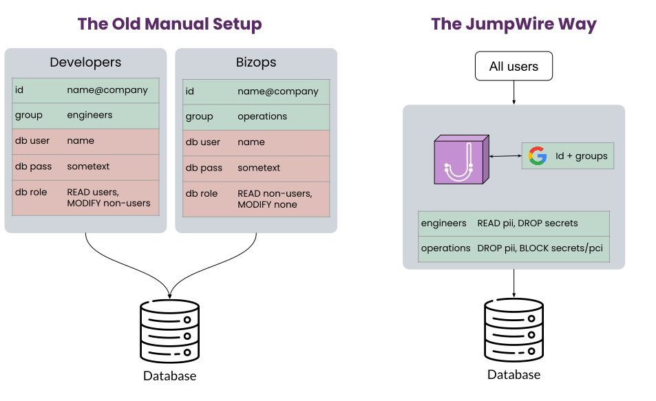
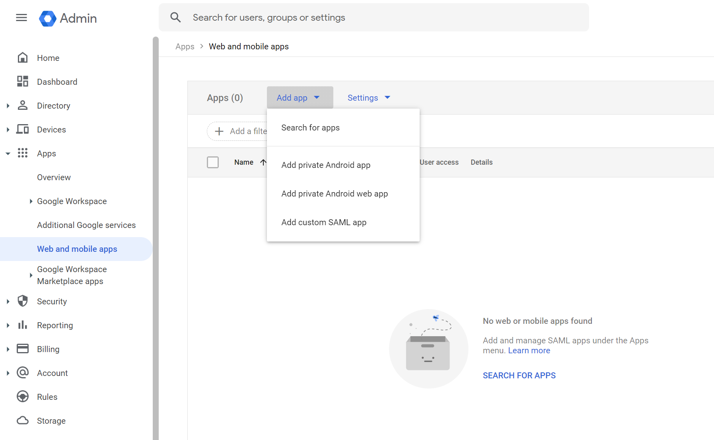
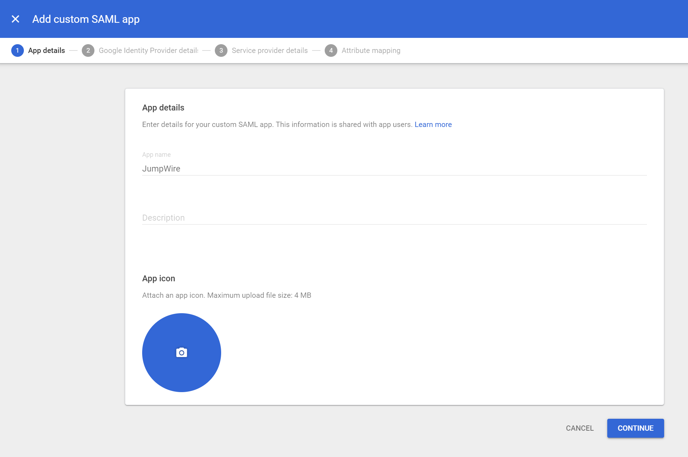
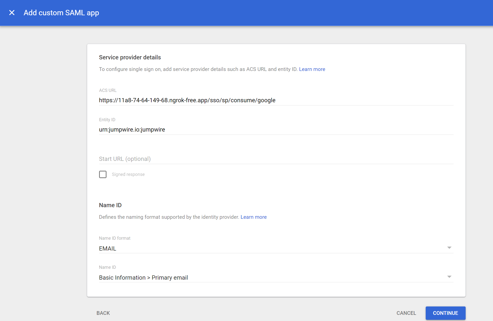
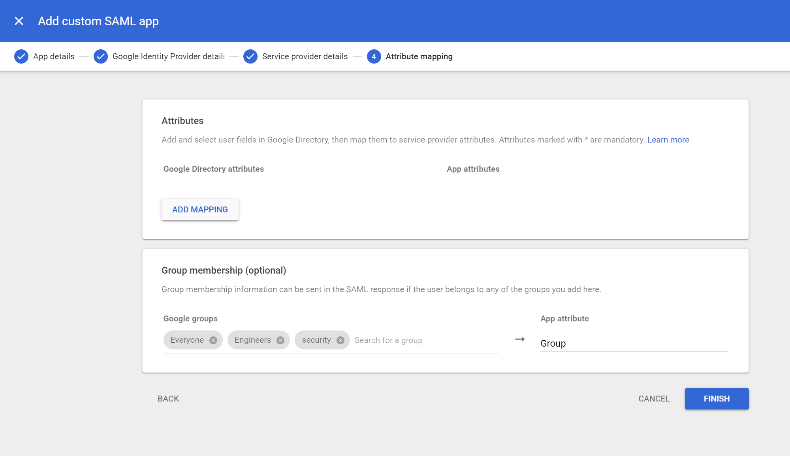
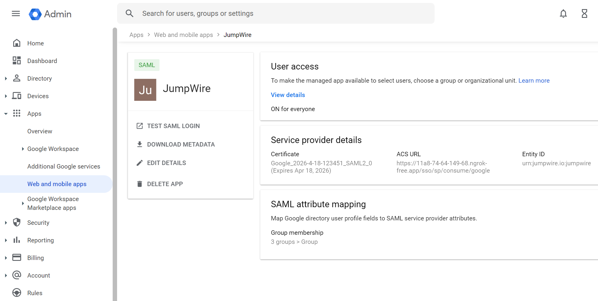
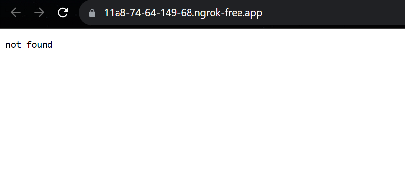

## SSO Guided setup

Using a Single Sign-On provider for database authentication is a feature supported by the JumpWire database gateway. Instead of creating users and roles directly in a database, JumpWire can leverage an existing SSO identity provider to authenticate users, and enforce data access privileges based on their group membership. This extends powerful concepts such as zero-trust and role-based access directly into your database layer, without the need to distribute new database clients to all end users.

### Benefits of SSO



- No provisioning of database users and roles
- No separate passwords for database access
- Data access privileges defined on data classification, not tables
- Data access based on user's group or role
- Access centrally managed from SSO provider

### Localhost Installation

> In this guide we will walk through an installation on a local host running a database. While this is not exactly the same as installing JumpWire in a production cloud environment, the mechanics are identical.

Follow the installation steps for [JumpWire](https://github.com/extragoodlabs/jumpwire#installation) and [jwctl](https://github.com/extragoodlabs/jwctl#installation). After downloading the latest release of `jwctl`, be sure to generate a token to use for communicating with the gateway.
```shell
mkdir -p $HOME/.config/jwctl
cat /dev/urandom | base64 | head -c 64 > $HOME/.config/jwctl/.token
```

We will use a minimal yaml configuration for running JumpWire to validate the installation:

```yaml
# ./jumpwire.yaml
# postgresql database running on my localhost
manifests:
  - id: 0779b97a-c04a-48f9-9483-22e8b0487de4
    name: my local db
    root_type: postgresql
    credentials:
      username: postgres
      password: postgres
    configuration:
      type: postgresql
      database: test_db
      # when running JumpWire in Docker Desktop, use "host.docker.internal"
      # when host networking is available (--network host), this can bet set to "localhost"
      hostname: host.docker.internal
      ssl: false
      port: 5432
```

Now let's spin up an instance of JumpWire! We'll generate an encryption key and a root token, the latter of which will be used by `jwctl` to communicate with the API. 

>*Note we are remapping the gateway PostgreSQL port to 6432 since there is a pg server running already locally on 5432*

```shell
export ENCRYPTION_KEY=$(openssl rand -base64 32)
export JUMPWIRE_ROOT_TOKEN=$(cat $HOME/.config/jwctl/.token)
docker run -d --rm --name jumpwire \
-p 4004:4004 -p 4443:4443 -p 6432:6432 \
-v $(pwd)/jumpwire.yaml:/etc/jumpwire/jumpwire.yaml \
-e JUMPWIRE_POSTGRES_PROXY_PORT=6432 \
-e JUMPWIRE_CONFIG_PATH=/etc/jumpwire \
-e JUMPWIRE_ENCRYPTION_KEY="${ENCRYPTION_KEY}" \
-e JUMPWIRE_ROOT_TOKEN="${JUMPWIRE_ROOT_TOKEN}" \
-e ACME_GENERATE_CERT=false \
ghcr.io/extragoodlabs/jumpwire:latest
```

After a few seconds of startup, inspect the logs for the running container.
```shell
$ docker logs [CONTAINER ID]
19:35:38.751 [info] [Honeybadger] Development mode is enabled. Data will not be reported until you deploy your app.
19:35:38.753 [info] Starting Horde.RegistryImpl with name Hydrax.Registry
19:35:38.754 [info] Starting Horde.DynamicSupervisorImpl with name Hydrax.Supervisor
19:35:38.754 [info] Starting Horde.DynamicSupervisorImpl with name Hydrax.TaskSupervisor

************************************************************
The JumpWire engine is up!

Check out our documentation at https://docs.jumpwire.io.

Version: 3.1.0
************************************************************

19:35:38.786 [info] Loading all encryption keys
19:35:38.786 [info] org_id=org_generic Loading encryption keys
19:35:38.787 [info] org_id=org_generic Generating new default AES key
19:35:39.254 [info] Starting [JumpWire.Websocket, JumpWire.ACME.Challenge, JumpWire.ACME.CertRenewal, %{id: Task, restart: :temporary, start: {Task, :start_link, [JumpWire.ACME, :ensure_cert, []]}}]
19:35:39.255 [info] Loading configuration objects from /etc/jumpwire
19:35:39.255 [info] Starting []
19:35:39.458 [info] org_id=org_generic manifest=0779b97a-c04a-48f9-9483-22e8b0487de4 PostgreSQL database enabled
```

We can confirm this with `jwctl` as well:
```shell
jwctl -u http://localhost:4004 status
#[INFO] Remote status:
#{
#  "clusters_joined": {},
#  "credential_adapters": [],
#  "domain": null,
#  "key_adapters": [
#    "DeltaCrdt"
#  ],
#  "ports": {
#    "http": 4004,
#    "https": 4443,
#    "mysql": 3306,
#    "postgres": 6432
#  },
#  "web_connected": false
#}
```

### Certificate generation

We'll create some self-signed certificates that will be used for both  TLS and signing the SAML requests. And since we are signing these certs to work with `localhost`, we'll need to create a root CA as well.

[Install mkcert](https://github.com/FiloSottile/mkcert#installation) if you haven't before, and run the install command. We'll use this to generate a new CA and bootstrap the TLS chain of trust. The CA will be imported into the local system trust store and can be removed later with `mkcert -uninstall`.

``` shell
mkcert -install
# Sudo password:
# The local CA is now installed in the system trust store! ⚡️
```

`mkcert -CAROOT` will print out the location of the CA files. These will remain even if you uninstall the CA from your system store.

Next we generate the certs, valid for a localhost domain.
```shell
mkcert localhost 127.0.0.1 ::1

# Created a new certificate valid for the following names 📜
#  - "localhost"
#  - "127.0.0.1"
#  - "::1"

# The certificate is at "./localhost+2.pem" and the key at "./localhost+2-key.pem" ✅

# It will expire on 6 December 2025 🗓
```

Now we can pass these certificates, along with the CA root, into our container. Restart the container with updated environment variables. Note we are copying the certificate files into `/etc/jumpwire` on the container as well as setting the environment variables:
```shell
docker stop jumpwire
docker run -d --rm --name jumpwire \
-p 4004:4004 -p 4443:4443 -p 6432:6432 \
-v $(pwd)/jumpwire.yaml:/etc/jumpwire/jumpwire.yaml \
-v $(pwd)/localhost+2.pem:/etc/jumpwire/localhost.pem \
-v $(pwd)/localhost+2-key.pem:/etc/jumpwire/localhost-key.pem \
-v $(mkcert -CAROOT)/rootCA.pem:/etc/jumpwire/ca.pem \
-e JUMPWIRE_POSTGRES_PROXY_PORT=6432 \
-e JUMPWIRE_CONFIG_PATH=/etc/jumpwire \
-e JUMPWIRE_ENCRYPTION_KEY="${ENCRYPTION_KEY}" \
-e JUMPWIRE_ROOT_TOKEN="${JUMPWIRE_ROOT_TOKEN}" \
-e JUMPWIRE_TLS_CERT=/etc/jumpwire/localhost.pem \
-e JUMPWIRE_TLS_KEY=/etc/jumpwire/localhost-key.pem \
-e JUMPWIRE_TLS_CA=/etc/jumpwire/ca.pem \
ghcr.io/extragoodlabs/jumpwire:latest
```

Confirm this is working by getting status from the `https` endpoint:
```shell
jwctl -u https://localhost:4443 status
# [INFO] Remote status:
# {
#   "clusters_joined": {},
#   "credential_adapters": [],
#   "domain": null,
#   "key_adapters": [
#     "DeltaCrdt"
#   ],
#   "ports": {
#     "http": 4004,
#     "https": 4443,
#     "mysql": 3306,
#     "postgres": 6432
#   },
#   "web_connected": false
# }
```


### Identity Provider configuration

The easiest way to configure SSO is with a metadata xml file from the identity provider. Most IdPs offer the metadata xml for download or through a URL. We can pass this xml file to the gateway to automatically configure the gateway as a service provider.

We'll set up a SAML app in Google Workspace, so we can centrally provision access by granting access to the app through Google Workspace Admin. Start by created a new "custom SAML app":



Enter a name that makes sense to you, like "Databases" or "JumpWire".



Next we are prompted to download the metadata xml file. This is great, it will make configuration much easier! We click the "DOWNLOAD METADATA" button and save the file in the same directory as our JumpWire configuration (`jumpwire.yaml`, `localhost+1.pem`, `localhost+1-key.pem`).

Now we configure the service provider details. For this to work with our localhost, we'll create a tunnel using `ngrok`. Google won't accept `https://localhost` for the Assertion Consumer Service (ACS) URL, which is the endpoint for SAML responses that our gateway is exposing as a service provider.

In a separate terminal, we start up an `ngrok` tunnel to the gateway's HTTPS endpoint, and make note of the hostname.
```shell
ngrok http https://localhost:4443

# ...
# Web Interface   http://127.0.0.1:4040
# Forwarding      https://11a8-74-64-149-68.ngrok-free.app -> https://localhost:4443             
```

The `ngrok` hostname will be the host we use for the ACS URL. The path for the URL will be `/sso/sp/consume/google`. For Entity ID, we must enter `urn:jumpwire.io:jumpwire`. We leave Start URL and Signed response blank and unchecked, respectively. Finally for Name ID format we select `EMAIL`.



Finally we configure group membership information to be included in the SAML response. This is useful for mapping data access privileges to an entire group rather than individuals. Google takes a unique approach for this, they don't send over all of the groups a user is a member of, but will send select groups if the user happens to belong to them. This is handy since we want to assign elevated privileges to a small number of groups anyway.

In the setup here, we've selected "Everyone", "Engineers", and "security" to be included for members of those groups. There aren't any additional attributes necessary, so that is left blank.



Click "FINISH" and we see our new app. We need to enable the app for our admin user, and turn it ON for everyone to test.



### Service Provider Configuration

The last step is to configure the gateway as a SAML service provider. We can use the IdP metadata xml file that we downloaded from Google, and pass in a couple of configuration parameters as environment variables.

This is what our local directory looks like with the files we've created so far:

```shell
ls -g
# total 16
# -rw-r--r-- 1 ryan 2227 Sep  6 18:19 GoogleIDPMetadata.xml
# -rw-r--r-- 1 ryan 1014 Sep  5 14:59 jumpwire.yaml
# -rw------- 1 ryan 1704 Sep  5 22:52 localhost+1-key.pem
# -rw-r--r-- 1 ryan 1476 Sep  5 22:52 localhost+1.pem
```

Let's stop and restart the container with additional environment variables for configuring SSO. This is specifying the location of the `idp.xml` file and specifies `google` as the IdP name.

```shell
docker stop jumpwire
docker run -d --rm --name jumpwire \
-p 4004:4004 -p 4443:4443 -p 6432:6432 \
-v $(pwd)/jumpwire.yaml:/etc/jumpwire/jumpwire.yaml \
-v $(pwd)/GoogleIDPMetadata.xml:/etc/jumpwire/idp.xml \
-v $(pwd)/localhost+2.pem:/etc/jumpwire/localhost.pem \
-v $(pwd)/localhost+2-key.pem:/etc/jumpwire/localhost-key.pem \
-v $(mkcert -CAROOT)/rootCA.pem:/etc/jumpwire/ca.pem \
-e JUMPWIRE_CONFIG_PATH=/etc/jumpwire \
-e JUMPWIRE_ENCRYPTION_KEY="${ENCRYPTION_KEY}" \
-e JUMPWIRE_POSTGRES_PROXY_PORT=6432 \
-e JUMPWIRE_ROOT_TOKEN="${JUMPWIRE_ROOT_TOKEN}" \
-e JUMPWIRE_SSO_METADATA_PATH=/etc/jumpwire/idp.xml \
-e JUMPWIRE_SSO_IDP=google \
-e JUMPWIRE_SSO_SIGNED_ENVELOPES=false \
-e JUMPWIRE_TLS_CERT=/etc/jumpwire/localhost.pem \
-e JUMPWIRE_TLS_KEY=/etc/jumpwire/localhost-key.pem \
-e JUMPWIRE_TLS_CA=/etc/jumpwire/ca.pem \
ghcr.io/extragoodlabs/jumpwire:latest
```

We can go back to the SAML app in the Google Admin from the section above, and click "TEST SAML LOGIN". It will send a valid SAML response to the ACS URL. If everything works (and we click through the ngrok landing page), we should see this:



Don't worry about the 404 `not found`! This is what the gateway returns for the root path of the API. Peaking at the ngrok output, we can see that the POST from Google IdP to the ACS URL is completing with a `302 Found`.
```shell
HTTP Requests
-------------
GET  /favicon.ico              404 Not Found
GET  /                         404 Not Found
POST /sso/sp/consume/google    302 Found
```

### Profit

Let's use our new SSO setup connect to our local database!

First we login via SSO using `jwctl`. Note we are still using the ngrok host for the SSO request to resolve correctly. This should open a page in the browser, and provide a code to be copied into the CLI.
```shell
jwctl -u https://11a8-74-64-149-68.ngrok-free.app auth login google
# [INFO] The login URL will open automatically in your browser. If it does not, you can enter it directly:

# https://11a8-74-64-149-68.ngrok-free.app/sso/auth/signin/google?target_url=%252Fsso%252Fresult

# After authenticating, enter the code displayed:
# SFMyNTY.g2gDaAJtAAAABmdvb2d...

# [INFO] Authenticated!
```

Now that we've authenticated, we can connect through our gateway to our local database! Simply start a psql shell using the gateway port `6432` instead of our local database port, and we will be prompted to log in using `jwctl db login`.
```shell
psql -h localhost -d storefront -p 6432
# NOTICE:  Protected by JumpWire
# Authenticate with jwctl:

# jwctl db login SFMyNTY.g2gDaAJtAAAAJGIwYTI2Y...
```

In a separate terminal, we execute the login command, again using the ngrok host as url.
```shell
jwctl -u https://11a8-74-64-149-68.ngrok-free.app db login SFMyNTY.g2gDaAJtAAAA...
# [INFO] Choose a database to connect to:
# [INFO] Authentication request to my local db is approved!
```

Switching back to our psql command terminal, we are now connected. Huzzah!
```shell
psql -h localhost -d storefront -p 6432
# NOTICE:  Protected by JumpWire
# Authenticate with jwctl:

# jwctl db login SFMyNTY.g2gDaAJtAAAAJGIwYTI2Y...
# psql (15.3 (Ubuntu 15.3-1.pgdg22.04+1))
# SSL connection (protocol: TLSv1.3, cipher: TLS_AES_256_GCM_SHA384, compression: off)
# Type "help" for help.

# storefront=#
```

### Notes on production release

In this walkthrough, we added a few steps that would not be necessary for a production installation of the JumpWire gateway.

#### TLS

We generated our own TLS certificates and provided them to the gateway container, along with a root CA. This is mostly due to running on a local host without a domain name or certificate service.

In a production installation, a certificate would be issued and provided to the container through a certificate service such as ACS. Alternatively, the gateway can provision its own certificates, as long as port 80 is reachable.

#### DNS

We also used `ngrok` in lieu of having an external DNS entry for our local host. In production, the gateway container host would be named through a DNS provider and a tunnel would not be necessary.
